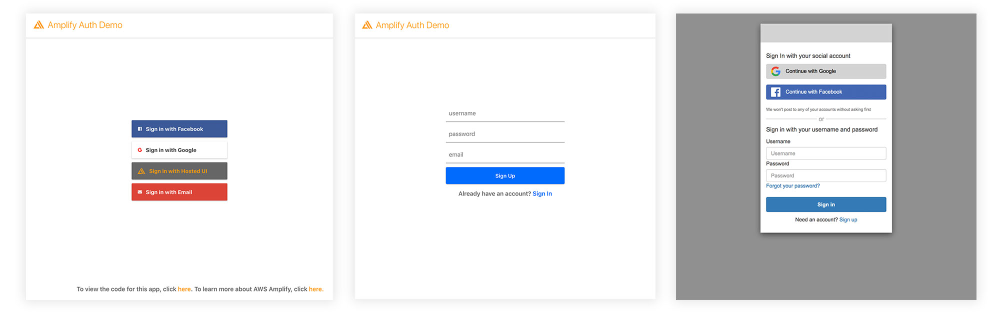

# AWS Amplify Auth Example



### The Complete Guide to Authentication with the Amplify Framework

This repo goes along with the Dev.to blog post [](The Complete Guide to Authentication with the Amplify Framework) & the demo at [amplifyauth.dev](https://www.amplifyauth.dev/).

### Methods used to authenticate in this app:

```js
// launch Hosted UI (Buttons.js)
Auth.federatedSignIn()

// specify OAuth provider (Buttons.js)
Auth.federatedSignIn({provider: 'Facebook'})
Auth.federatedSignIn({provider: 'Google'})

// Manually sign up & sign in users (Form.js)
Auth.signUp({
  username, password, attributes: { email }
})
Auth.confirmSignUp(username, confirmationCode)
Auth.signIn(username, password)
```

To learn how to build this app, check out the post or view [the documentation](https://aws-amplify.github.io/docs/js/authentication).